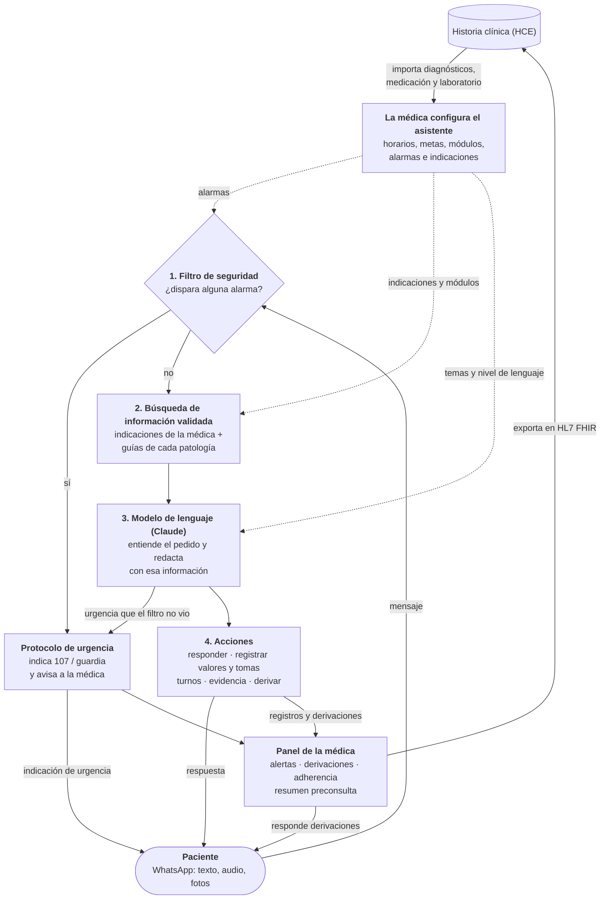

# Asistente IA de seguimiento entre consultas: simulador

Esta app simula el flujo propuesto en el trabajo *“Propuesta de un asistente conversacional basado en IA para la adherencia terapéutica y el seguimiento de pacientes”*. Usa el caso ilustrativo del trabajo: Marta (DM2 + HTA) y la Dra. Lucía, su médica de cabecera.

En una misma pantalla se ven los dos lados del sistema:

- **Izquierda: panel de la médica (web).** Desde acá se configura el asistente y se sigue a la paciente.
- **Derecha: el teléfono de la paciente** (WhatsApp simulado). Ahí Marta conversa con el asistente.

## Cómo funciona

La médica configura, durante la consulta, un asistente para cada paciente. Entre consultas, la paciente le escribe al asistente por WhatsApp. Cada mensaje pasa por estas etapas:

1. **Filtro de seguridad.** Antes de cualquier otra cosa, el mensaje se compara con las alarmas que configuró la médica: dolor de pecho, hemorragia, hipoglucemia grave y otras. Si alguna se dispara, el asistente no intenta resolver nada. Indica llamar a emergencias y avisa a la médica.
2. **Búsqueda de información validada.** Si no hay alarma, se buscan las indicaciones propias de la médica y los fragmentos de las guías de cada patología activa (DM2, HTA). Es lo que se llama RAG.
3. **Modelo de lenguaje.** Claude interpreta qué quiere la paciente (una duda, registrar un valor, pedir un turno, algo que tiene que ver la médica) y redacta la respuesta usando sólo esa información. Si detecta una urgencia que el filtro no vio, también activa la alarma.
4. **Acciones.** Según el caso, el asistente responde, registra el valor o la toma de medicación, reserva un turno, consulta evidencia científica o deriva la consulta a la médica.

Todo lo que pasa queda disponible para la médica en su panel y se puede exportar a la historia clínica en formato estándar (HL7 FHIR).



El asistente **no diagnostica, no cambia medicación y no reemplaza la consulta**. Lo que excede lo que la médica habilitó se deriva a ella.

## Guía de uso

### Para la médica (panel izquierdo)

1. **Importar los datos de la paciente.** En *1 · Configuración*, el botón **Importar datos de Marta** trae de la historia clínica los diagnósticos, la medicación y el último laboratorio.
2. **Configurar el asistente.** El formulario viene precargado y se puede ajustar:
   - **Medicación y horarios:** a esas horas el asistente le recuerda cada toma a la paciente.
   - **Metas y umbrales:** los valores objetivo y los que generan un aviso para la médica. Cada patología trae los suyos por defecto.
   - **Módulos:** las patologías que el asistente conoce (DM2, HTA). Se activan solos según los diagnósticos de la HCE.
   - **Temas habilitados:** lo que el asistente puede responder. Lo demás lo deriva a la médica.
   - **Comunicación:** el nivel de lenguaje (simple, intermedio o técnico) y el canal (WhatsApp o app).
   - **Indicaciones propias:** por ejemplo, "Caminar 30 minutos al menos 5 días por semana". Tienen prioridad sobre las guías generales.

   Al terminar, **Generar asistente**. Si se cambia algo después, **Guardar cambios**. Si cambian las indicaciones o los horarios, la paciente recibe un aviso.
3. **Alarmas.** Debajo del formulario está la lista de alarmas, con efecto inmediato:
   - **Pausar o reactivar** cualquier alarma con la tilde.
   - **Modificar:** cambiar las frases que la disparan, el valor límite o la indicación inmediata para la paciente.
   - **Agregar:** por frases ("fiebre alta", "escalofríos") o por umbral de una medición ("glucemia > 400").
   - **Eliminar:** sólo las que no son genéricas. Las genéricas (dolor torácico, hemorragia, ACV…) se pueden pausar, pero no eliminar.
4. **Seguir a la paciente.** En *2 · Panel de seguimiento*:
   - Indicadores de adherencia (proporción de días cubiertos, tomas confirmadas) y de control (glucemias en meta).
   - Gráfico de glucemias y grilla de tomas por día.
   - **Alertas** (valores fuera de rango, tomas omitidas): se marcan como vistas.
   - **Derivaciones:** las consultas que el asistente le pasó, con un resumen y, si corresponde, la foto. Se responden desde ahí y la respuesta le llega a la paciente.
   - **Sugerencias basadas en evidencia:** cuando una consulta implica un posible cambio de tratamiento, la evidencia llega sólo a la médica, nunca a la paciente.
   - **Resumen preconsulta:** un resumen del período para leer antes de la próxima visita.
5. **Evidencia.** Consultar literatura médica sobre el caso (OpenEvidence, simulado).
6. **HCE · FHIR · CDS Hooks.** Descargar todo lo registrado en formato FHIR y ver cómo aparecerían las alertas dentro de la historia clínica al abrir el registro de la paciente.
7. **Trazas del sistema.** Para cada mensaje, el recorrido que hizo: qué alarmas se evaluaron, qué información se usó, qué decidió el modelo y qué se registró.

### Para la paciente (teléfono)

- **Escribir** como en WhatsApp. Los botones de abajo traen mensajes de ejemplo.
- **Mandar un audio** con el micrófono. Se transcribe automáticamente en Chrome o Edge.
- **Mandar una foto o un PDF** con el clip:
  - del glucómetro o del tensiómetro: el valor queda registrado;
  - de un remedio: el asistente confirma si es el que tiene indicado;
  - de una lesión: no la analiza, se la envía a la médica;
  - de un análisis: guarda los valores para la médica.

  En *Archivos de prueba* hay ejemplos listos para usar.
- **Recordatorios:** a la hora de cada toma llega un aviso con los botones *Sí, la tomé* / *No la tomé*.
- **Turnos:** al pedir un turno, el asistente ofrece horarios y se elige uno con un toque.
- **Qué esperar:**
  - Las dudas sobre el tratamiento se responden con la información que validó la médica.
  - Lo que tiene que ver la médica se le deriva, y su respuesta llega por el mismo chat.
  - Ante una urgencia, el asistente indica llamar al 107 o ir a la guardia.

### Controles de la simulación (barra superior)

La barra superior permite manejar el tiempo de la simulación:

- **Reloj simulado:** la fecha y hora de la simulación.
- **⏭ Próxima toma:** adelanta el reloj hasta el próximo horario de medicación y envía el recordatorio.
- **+1 h:** adelanta una hora.
- **Simular 14 días:** genera dos semanas de seguimiento de ejemplo para ver el panel completo. Conviene usarlo justo después de generar el asistente.
- **Reiniciar:** borra todo y vuelve al inicio.

Arriba, junto al título, se ve qué motor de IA está activo ("Motor IA: Claude Code · sonnet" o "Modo simulado").

### Recorrido sugerido para una demo

1. Importar los datos de Marta y generar el asistente.
2. Desde el teléfono, probar algunos chips: una dosis olvidada, un valor de glucemia, un pedido de turno o la pregunta por Ozempic.
3. Adjuntar archivos de prueba, por ejemplo el glucómetro con 48 (dispara la alarma) o el informe de laboratorio.
4. Pausar una alarma y repetir el mensaje para ver la diferencia.
5. Usar **Simular 14 días** y recorrer el panel: responder una derivación y generar el resumen preconsulta.
6. Exportar el Bundle FHIR y simular la apertura en la HCE.
7. Mirar las **Trazas del sistema** para explicar cómo se procesó cada mensaje.

---

# Instalación y detalles técnicos

## Requisitos

- [Node.js](https://nodejs.org/) 18 o superior (LTS recomendado).
- Token de claude code que se guarda en el `.env` bajo `CLAUDE_CODE_OAUTH_TOKEN=...`. Si no se provee, se corre una versión simulada pero sin interacción con ningún llm 

## Cómo correrla

### Vía script de inicialización de bash

```bash
./iniciar.sh
```

El script instala las dependencias la primera vez, crea `.env` y abre el navegador. Para frenar la app: `Ctrl+C`.

### Manualmente

Desde la terminal de windows se puede correr

```bash
cp .env.example .env
npm install 
node server.js
```


## Qué es real y qué es mock

| Componente | Estado |
|---|---|
| Asistente especializado (intención, respuesta, lectura de fotos/PDF, resumen) | **Real**: Claude a través de Claude Code (`claude -p`, con tu suscripción) y salida JSON validada. Cada respuesta tarda ~5–8 s. Si falla, se usa el respaldo simulado. |
| Filtro de seguridad clínica | **Real**: alarmas configurables que se evalúan *antes* del LLM (primera capa, determinística), más un doble control del modelo. Las genéricas están en `knowledge/alarmas_genericas.json`. Desde *Configuración → Alarmas* la médica puede pausarlas, modificarlas, agregar nuevas o eliminar las que no son genéricas. |
| Base especializada por patología + RAG | **Real**: fragmentos DM2 y HTA en `knowledge/`, con recuperación tipo BM25. |
| Transcripción de audio | **Real** en el navegador (Web Speech API; Chrome o Edge). |
| HCE / servidor FHIR | **Mock** (`src/mocks/hce.js`) |
| OpenEvidence API | **Mock** (`src/mocks/openevidence.js`): respuestas predefinidas con citas reales; la consulta se anonimiza antes de enviarse. |
| WhatsApp Business | **Mock**: la interfaz simula el canal. |
| Agenda de turnos | **Mock** (`src/mocks/agenda.js`) |
| Exportación FHIR R4 y servicio CDS Hooks | **Real**: `GET /api/fhir/bundle`, `GET /cds-services`, `POST /cds-services/seguimiento-entre-consultas`. |

Si el indicador del motor dice "Modo simulado", al pasar el mouse por encima se ve el motivo.

En modo simulado, el tipo de foto se deduce del nombre del archivo (por ejemplo, `glucometro_120.jpg` o `tensiometro_150_90.jpg`). Con IA real, se analiza la imagen.

## Cómo agregar una patología (sin tocar código)

Cada módulo es un archivo `knowledge/<id>.json` con dos partes:

- `fragmentos`: el conocimiento validado que usa el RAG.
- `configuracion`: los valores por defecto de la patología, que la médica después ajusta por paciente.
  - `variables`: las mediciones, con unidad, UCUM y LOINC.
  - `metas`, `umbrales` y `alertas`: los avisos no urgentes a la médica.
  - `alarmas`: el protocolo de urgencia.
  - `instruccionesModelo`: pautas para el modelo, que pueden usar `{umbrales.x}` y `{metas.x}`.

El campo `snomed` indica para qué diagnósticos de la HCE se activa el módulo por defecto. Al copiar `dm2.json` o `hta.json` como plantilla y reiniciar la app, el módulo nuevo aparece en el panel con sus campos y sus alarmas.

## Estructura

```
server.js              API + archivos estáticos
src/assistant.js       pipeline: seguridad → RAG → LLM → registro/evidencia/derivación/turnos
src/vision.js          fotos e informes (registro, no diagnóstico)
src/safety.js          señales de alarma y umbrales
src/modulos.js         carga los módulos (conocimiento + configuración por patología)
src/alarmas.js         alarmas configurables (genéricas + módulos + médica)
src/rag.js             recuperación sobre los fragmentos de los módulos
src/clinic.js          observaciones, tomas, alertas, métricas (PDC)
src/fhir.js            Bundle FHIR R4 + CDS Hooks
src/seed.js            14 días de datos de ejemplo
src/mocks/             HCE, OpenEvidence, agenda
knowledge/             módulos DM2 y HTA + alarmas genéricas
muestras/              archivos de prueba (ficticios)
public/                interfaz
data/                  estado de la simulación (se crea solo)
```

*Prototipo académico. El contenido clínico es una adaptación simplificada para demostración, y todos los datos son ficticios.*
